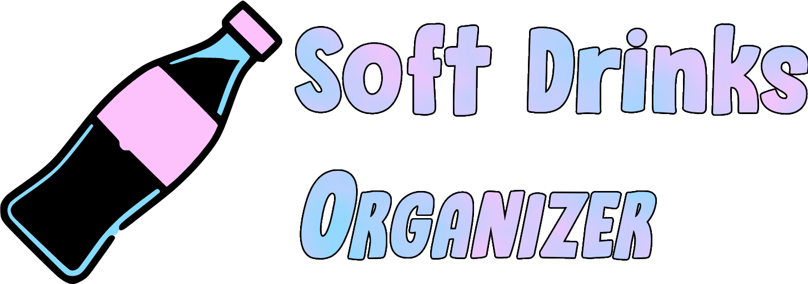

# Soft Drinks Organizer

### Calcan Teodor Alexandru

### Amăriucăi Cosmin

<p align="center">
<br/>
  
<br/>
</p>

## Ce ofera Soft Drinks Organizer?

- O gama extinsa de bauturi non-alcolice si informatii detaliate despre acestea
- Un formular pentru gasirea bauturii potrivite bazat pe un set de parametri
- Gestionarea bauturilor in diferite liste si printr-un sistem de "whishlist"
- Descarcarea listelor si whishlistului in format .csv
- Statistici despre popularitatea bauturilor

## Functiile folosite pentru realizarea Soft Drink Organizer-ului

### functions

```getProductID```

- Returneaza ID-ul produsului din baza de date

```isFav```

- Verificare daca produsul este in whishlist

```toggleFav```

- Introduce sau sterge produsele din whishlist

```getProductByID```

- Returneaza frodusul pe baza ID-ului

```emptyInputRegister```

- Verifica daca datele de inregistrare au fost introduse

```emptyInputLogin```

- Verifica daca datele de autentificare au fost introduse

```invalidEmail```

- Verifica daca emailul are formatul corect

```invalidUser```

- Verifica daca numele de utilizator contine doar litere si cifre

```invalidPwd```

- Verifica daca ambele parole introduse la inregistrare sunt identice

```userRpt```

- Verifica daca numele de utilizator sau emailul exista deja

```createUser```

- Creeaza un entry in baza de date pentru un utilizator nou

```loginUser```

- Functia de logare pe site
- Aceasta retine si informatiile in formular in caz de este completat fara sa fii logat

```wrongPwd```

- Verifica daca parola introdusa la logare este corecta

```updateEmail```

- Permite utilizatorului schimbarea emailului

```updatePwd```

- Permite utilizatorului schimbarea parolei

```getEmail```

- Returneaza emailul

```startTableDesk```

- Creeaza tabelul de produse (internal use)

```allProductsDesk```

- Afiseaza lista completa de produse

```selectedProductsDesk```

- Afiseaza lista de produse in functie de preferintele mentionate in formular

```allWishlistDesk```

- Afisseaza produsele din whishlist

```getProductsDesk```

- Returneaza informatiile despre produse din baza de date

```WishlistDesk```

- Transforma fiecare produs intr-o linie de tabel pentru pagina wishlist

```PopularityContest```

- Verifica de cate ori apar produsele in liste, incluzand wishlist-ul

### beverage functions

```getProductImageLink```

- Face parte dintr-o suita de functii care extrage informatii de pe "openfoodfacts.org"
- Aceasta, in particular, returneaza poza cu produsul relevant

```getProductIngredients```

- Precum functia de mai sus aceasta returneaza informatii de pe "openfoodfacts.com"
- Functia aceasta, in schimb, returneaza lista de ingrediente

```getNova```

- Aceasta functie returneaza NOVA ratng-ul produsului

```getNutriscore```

- In final, aceasta functie returneaza Nutri-Score-ul produsului

### preference functions

```getID```

- Returneaza ID-ul utilizatorului

```getAcid```

- Returneaza preferinta fata de parametrul "acid"

```getNatural```

- Returneaza preferinta fata de parametrul "natural"

```getLowCal```

- Returneaza preferinta fata de parametrul "lowcal"

```getMilk```

- Returneaza preferinta fata de parametrul "milk"

```getCofe```

- Returneaza preferinta fata de parametrul "cofe"

```getGust```

- Returneaza preferinta fata de parametrul "gust"

```getAroma```

- Returneaza preferinta fata de parametrul "aroma"

```updatePreferences```

- Permte schimbarea preferintelor

### list functions

```createList```

- Creeaza lista noua

```checkListName```

- Verifica daca este dela o lista cu acelasi nume

```addBevToList```

- Adauga bauturi la lista

```getListID```

- Returneaza ID-ul listei

```getUserListsOptions```

- Afiseaza toate listele plus optiunea de a creea una noua

```removeList```

- Elimina lista curenta

```removeItemFromList```

- Elimina produsul din lista


